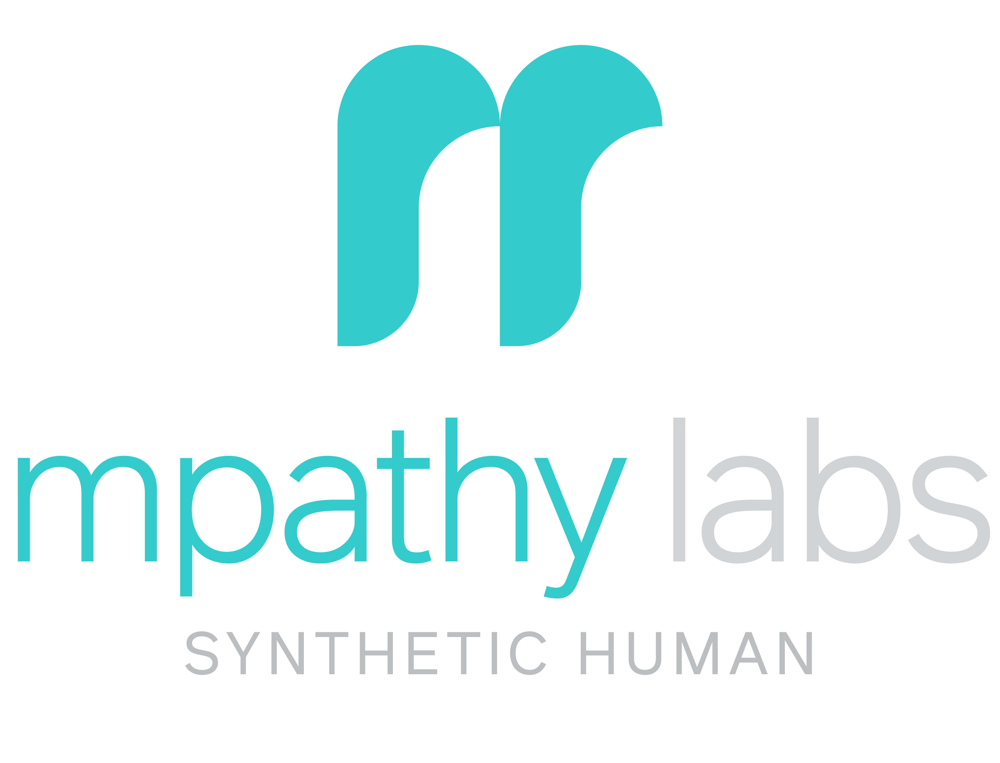

<!--
Copyright (C) 2024-2024, MPATHYLABS CORP. All rights reserved.

This file is a part of the MPATHYLABS Framework.

Your use and / or redistribution of this software in source and / or
binary form, with or without modification, is subject to: (i) your
ongoing acceptance of and compliance with the terms and conditions of
the MPATHYLABS License Agreement; and (ii) your inclusion of this notice
in any version of this software that you use or redistribute.
A copy of the MPATHYLABS License Agreement is available by contacting
MPATHYLABS. at https://mpathylabs.ai
-->

